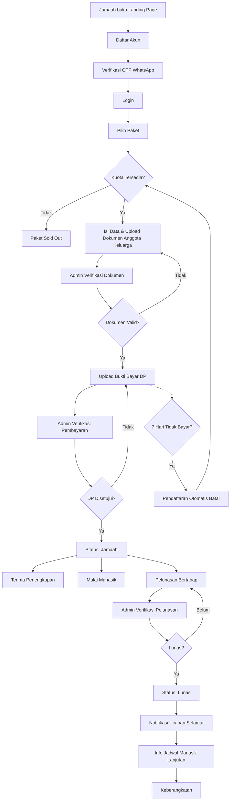

# PRD — Sistem Landing Page & Pendaftaran Terpusat Umrah & Haji Khusus PT. Zein Internasional

## 1. Product Overview

**Nama Produk:** Sistem Landing Page & Pendaftaran Umrah/Haji Khusus — PT. Zein Internasional

**Ringkasan Produk:**
Website landing page sekaligus sistem pendaftaran terpusat untuk jamaah umrah dan haji khusus. Sistem menggantikan pendaftaran manual dengan alur digital: pendaftaran akun, pemilihan paket, upload dokumen, pembayaran DP, hingga pelunasan.

**Latar Belakang:**
Proses pendaftaran jamaah saat ini masih manual, menyebabkan data pendaftar tidak terpusat dan sulit dikelola.

**Masalah yang Ingin Diselesaikan:**
- Data pendaftar tersebar/tidak terpusat
- Proses pendaftaran manual memakan waktu dan rawan kesalahan

**Tujuan Produk:**
- Merapikan dan memusatkan data pendaftar dalam satu sistem
- Mempermudah proses pendaftaran, verifikasi dokumen, dan pembayaran
- Memberi kemudahan bagi admin mengelola data jamaah dan paket

---

## 2. Target Users

| Pengguna | Kebutuhan |
|---|---|
| **Calon Jamaah/Jamaah** | Mendaftar akun, memilih paket, upload dokumen, melakukan pembayaran, memantau status pendaftaran |
| **Admin** | Mengelola paket, memverifikasi dokumen & pembayaran, mengelola data jamaah, mengelola konten landing page |

---

## 3. User Roles & Permissions

| Role | Hak Akses |
|---|---|
| **Calon Jamaah/Jamaah** | Daftar & login akun, pilih paket, upload dokumen, upload bukti pembayaran, lihat status & saldo pembayaran, ajukan pembatalan (jika belum bayar DP) |
| **Admin** (satu level, akses penuh) | Kelola paket & kuota kursi, verifikasi dokumen, verifikasi pembayaran, kelola data jamaah, update status perlengkapan, kirim notifikasi, kelola galeri & video, kelola konten landing page (future), lihat dashboard |

---

## 4. User Journey

1. Calon jamaah membuka landing page → melihat info paket, layanan, legalitas, dll
2. Mendaftar akun (Nama sesuai KTP, Email, No. HP, Password) → verifikasi OTP WhatsApp
3. Login → memilih paket umrah/haji
4. Mendaftarkan anggota keluarga (jika ada) beserta dokumen masing-masing
5. Upload bukti pembayaran DP
6. Admin verifikasi dokumen & pembayaran DP
7. Status berubah menjadi **Jamaah** → menerima perlengkapan → mulai manasik
8. Melunasi sisa pembayaran
9. Status **Lunas** → menerima notifikasi ucapan selamat
10. Menerima info jadwal manasik lanjutan via WhatsApp
11. Berangkat

---

## 5. Business Flow

**Alur Pendaftaran Utama**

| Input | Proses | Sistem | Output | Langkah Berikutnya |
|---|---|---|---|---|
| Data akun (nama, email, HP, password) | Registrasi | Kirim OTP WhatsApp | Akun terverifikasi | Login |
| Pilihan paket | Cek kuota kursi | Kurangi kuota jika tersedia | Paket terpilih | Isi data anggota keluarga |
| Data & dokumen anggota keluarga (NIK, KK, Paspor, dst) | Upload dokumen | Simpan data, status "Menunggu Verifikasi Dokumen" | Dokumen terkirim | Admin verifikasi dokumen |
| Bukti transfer DP | Upload bukti bayar | Status "Menunggu Verifikasi Pembayaran" | Bukti terkirim | Admin verifikasi pembayaran |
| Approval admin | Cek manual rekening | Status → "Jamaah", kirim invoice | Jamaah aktif | Terima perlengkapan, mulai manasik |
| Pembayaran pelunasan | Upload bukti bayar | Admin verifikasi | Status → "Lunas" | Notifikasi ucapan selamat, info manasik lanjutan via WA |

---

## 6. Feature Requirements

### 6.1 Registrasi & Login Jamaah
- **Tujuan:** Membuat akun terpusat untuk jamaah
- **Pengguna:** Calon Jamaah
- **Alur:** Isi data → verifikasi OTP WhatsApp → akun aktif
- **Input:** Nama sesuai KTP, Email, No. HP, Password
- **Proses:** Validasi data, kirim OTP WhatsApp
- **Output:** Akun aktif
- **Kondisi Berhasil:** OTP benar, akun terverifikasi
- **Kondisi Gagal:** OTP salah/kedaluwarsa → kirim ulang OTP
- **Business Rules:** Satu akun hanya bisa aktif di satu pendaftaran/paket pada satu waktu

### 6.2 Pemilihan Paket
- **Tujuan:** Jamaah memilih paket umrah/haji
- **Pengguna:** Jamaah
- **Alur:** Lihat daftar paket (nama, harga, tanggal berangkat, durasi, fasilitas, dsb) → pilih paket
- **Input:** Pilihan paket
- **Proses:** Cek ketersediaan kursi
- **Output:** Paket terpilih untuk pendaftaran
- **Kondisi Berhasil:** Kursi tersedia
- **Kondisi Gagal:** Kursi penuh → paket berstatus "Sold Out" & non-aktif, tidak bisa dipilih
- **Business Rules:** Admin mengatur jumlah kuota per paket

### 6.3 Pendaftaran Anggota Keluarga
- **Tujuan:** Mendaftarkan satu atau lebih anggota keluarga dalam satu pendaftaran
- **Pengguna:** Jamaah
- **Alur:** Isi data & upload dokumen tiap anggota
- **Input:** NIK + upload KTP, KK + upload KK, upload Paspor, Hubungan keluarga, (jika menikah) upload Buku Nikah, (jika anak) upload Akta Kelahiran
- **Proses:** Simpan data, kirim ke admin untuk verifikasi
- **Output:** Data anggota keluarga tersimpan, status "Menunggu Verifikasi Dokumen"
- **Kondisi Berhasil:** Dokumen lengkap & sesuai format
- **Kondisi Gagal:** Dokumen kurang/tidak valid → admin tolak dengan alasan, jamaah upload ulang
- **Business Rules:** Persyaratan dokumen sesuai standar (paspor min. 2 suku kata nama, masa berlaku min. 7 bulan, pas foto 4x6 = 5 lembar, dsb — lihat Business Rules)

### 6.4 Pembayaran DP
- **Tujuan:** Jamaah membayar uang muka untuk mengunci pendaftaran
- **Pengguna:** Jamaah
- **Alur:** Upload bukti transfer → admin verifikasi manual → approve/reject
- **Input:** Bukti transfer DP
- **Proses:** Cek manual oleh admin di rekening bank
- **Output:** Status "Jamaah" jika disetujui, invoice dikirim
- **Kondisi Berhasil:** Bukti valid → status naik jadi Jamaah
- **Kondisi Gagal:** Bukti tidak valid → notifikasi penolakan, jamaah upload ulang
- **Business Rules:**
  - DP 10% jika dibayar 3 bulan sebelum keberangkatan
  - DP 40% jika dibayar 2 bulan sebelum keberangkatan
  - Jika 7 hari sejak pilih paket belum bayar DP → pendaftaran otomatis batal, kursi kembali tersedia

### 6.5 Pelunasan Pembayaran
- **Tujuan:** Jamaah melunasi sisa biaya paket
- **Pengguna:** Jamaah
- **Alur:** Upload bukti transfer pelunasan → admin verifikasi
- **Input:** Bukti transfer pelunasan
- **Proses:** Cek manual oleh admin
- **Output:** Status "Lunas", notifikasi ucapan selamat via WhatsApp
- **Kondisi Berhasil:** Pelunasan diterima sebelum jatuh tempo (40 hari sebelum keberangkatan)
- **Kondisi Gagal:** Bukti tidak valid → notifikasi penolakan, upload ulang
- **Business Rules:** Pelunasan paling lambat 40 hari sebelum keberangkatan
- **Catatan:** Sistem tabungan (setoran fleksibel bertahap) masuk **Future Development**; MVP cukup pembayaran pelunasan sekali/bertahap sederhana [TBD — perlu ditentukan mekanisme detail pelunasan bertahap di MVP]

### 6.6 Verifikasi Dokumen (Admin)
- **Tujuan:** Memastikan dokumen jamaah valid
- **Pengguna:** Admin
- **Alur:** Cek dokumen → approve atau tolak dengan alasan
- **Input:** Dokumen yang diupload jamaah
- **Proses:** Review manual
- **Output:** Status dokumen (Disetujui/Ditolak + alasan)
- **Kondisi Berhasil:** Dokumen lengkap & sesuai syarat
- **Kondisi Gagal:** Dokumen kurang/salah → alasan penolakan dicatat, jamaah diminta upload ulang

### 6.7 Verifikasi Pembayaran (Admin)
- **Tujuan:** Memastikan pembayaran (DP/pelunasan) sah
- **Pengguna:** Admin
- **Alur:** Cek manual bukti transfer di rekening → approve/reject
- **Output:** Status pembayaran diperbarui, invoice/notifikasi terkirim

### 6.8 Manajemen Perlengkapan (Admin)
- **Tujuan:** Mencatat status pemberian perlengkapan (kain ihram, koper, dll)
- **Pengguna:** Admin
- **Alur:** Update status per jamaah
- **Status:** Belum Dikirim → Sudah Dikirim/Diterima

### 6.9 Manajemen Paket & Kuota Kursi (Admin)
- **Tujuan:** Mengelola paket umrah/haji dan ketersediaan kursi
- **Pengguna:** Admin
- **Alur:** Tambah/edit/hapus paket, atur jumlah kuota kursi
- **Business Rules:** Jika kuota habis, paket otomatis berstatus Sold Out & non-aktif

### 6.10 Pembatalan Pendaftaran
- **Tujuan:** Memproses pembatalan oleh jamaah
- **Pengguna:** Jamaah & Admin
- **Alur:** Jamaah ajukan pembatalan → sistem hitung fee (jika sudah bayar DP) → admin proses
- **Business Rules:**
  - Belum bayar DP sama sekali → bebas batal, tanpa biaya
  - Sudah bayar DP → kena cancelation fee:

    | Waktu Pembatalan | Biaya |
    |---|---|
    | Setelah menjadi pendaftar (sudah DP) | 2% dari harga paket |
    | 25 hari sebelum keberangkatan | 25% dari harga paket |
    | 15 hari sebelum keberangkatan | 65% dari harga paket |
    | 6 hari sebelum keberangkatan | 85% dari harga paket |

  - Sistem hanya menghitung & menampilkan nominal refund; transfer dilakukan manual oleh admin di luar sistem

### 6.11 Dashboard Admin
- **Tujuan:** Memberi ringkasan informasi operasional
- **Pengguna:** Admin
- **MVP:** Dashboard dasar (jumlah pendaftar per paket, status pembayaran, jamaah mendekati jatuh tempo)
- **Future Development:** Dashboard dengan grafik lebih kompleks

### 6.12 Manajemen Galeri & Video
- **Tujuan:** Admin mengelola galeri foto & video YouTube di landing page
- **Pengguna:** Admin
- **Status MVP:** Future Development

### 6.13 Manajemen Konten Landing Page
- **Tujuan:** Admin mengedit konten (Profil, Legalitas, Layanan, Skema Pendaftaran, Skema Perjalanan, Layanan di Saudi) secara simpel
- **Pengguna:** Admin
- **Status MVP:** Future Development

---

## 7. Detailed User Flow

**Jamaah:**
1. Buka landing page → daftar akun → verifikasi OTP WhatsApp
2. Login → pilih paket (cek kuota otomatis)
3. Tambah anggota keluarga & upload dokumen masing-masing
4. Tunggu admin verifikasi dokumen (approve/reject)
5. Upload bukti transfer DP → tunggu verifikasi admin
6. Status jadi "Jamaah" → terima invoice, perlengkapan, mulai manasik
7. Menabung/bayar pelunasan bertahap → upload bukti tiap kali bayar
8. Lunas → terima notifikasi ucapan selamat
9. Terima info jadwal manasik lanjutan via WhatsApp
10. Berangkat

**Admin:**
1. Kelola paket & kuota kursi
2. Terima notifikasi ada pendaftaran/dokumen/pembayaran baru
3. Verifikasi dokumen (approve/reject + alasan jika reject)
4. Verifikasi pembayaran (approve/reject)
5. Update status perlengkapan per jamaah
6. Proses pembatalan (hitung fee jika berlaku)
7. Pantau dashboard operasional

---

## 8. Business Rules

- DP: 10% (3 bulan sebelum berangkat), 40% (2 bulan sebelum berangkat); pelunasan paling lambat 40 hari sebelum keberangkatan
- Dokumen wajib: Paspor asli (nama min. 2 suku kata, masa berlaku min. 7 bulan), Foto copy KTP, Foto copy KK, Akta lahir (anak bersama ortu), Surat/Buku Nikah asli+fotocopy (suami istri), Pas foto 4x6 = 5 lembar (latar putih, fokus wajah 80%, tanpa seragam dinas, tanpa kacamata), Kartu Kuning/Sertifikat Suntik Meningitis; dokumen diserahkan paling lambat 1 bulan sebelum keberangkatan
- Cancelation fee (jika sudah bayar DP): 2% (setelah jadi pendaftar) / 25% (H-25) / 65% (H-15) / 85% (H-6)
- Belum bayar DP sama sekali → bebas batal tanpa biaya
- Pendaftaran otomatis batal jika DP belum dibayar dalam 7x24 jam sejak memilih paket; kursi kembali tersedia
- Kuota kursi per paket dikelola admin; jika habis, paket otomatis Sold Out & non-aktif
- Satu akun hanya bisa aktif di satu pendaftaran/paket pada satu waktu
- Semua notifikasi dikirim via WhatsApp
- Verifikasi pembayaran & dokumen dilakukan manual oleh admin

---

## 9. Data Requirements

**Data Akun Jamaah:** Nama sesuai KTP, Email, No. HP, Password

**Data Anggota Keluarga (per orang):** NIK + file KTP, No. KK + file KK, No. Paspor + file Paspor, Hubungan keluarga, file Buku Nikah (jika menikah), file Akta Kelahiran (jika anak)

**Data Paket:** Nama paket, harga, tanggal keberangkatan, durasi, fasilitas, kuota kursi, status (aktif/sold out)

**Data Pembayaran:** Jenis (DP/pelunasan), nominal, bukti transfer, status verifikasi, tanggal

**Data Perlengkapan:** Status (Belum Dikirim/Sudah Dikirim) per jamaah

**Data Invoice:** Nama jamaah, paket, total harga, jumlah dibayar, sisa tagihan, tanggal jatuh tempo

---

## 10. Notification

| Kejadian | Penerima | Waktu Kirim | Isi | Channel |
|---|---|---|---|---|
| Registrasi akun | Jamaah | Saat daftar | Kode OTP | WhatsApp |
| Dokumen ditolak | Jamaah | Saat admin tolak | Alasan penolakan | WhatsApp |
| Pembayaran DP disetujui | Jamaah | Saat admin approve | Invoice | WhatsApp |
| Pembayaran DP/pelunasan ditolak | Jamaah | Saat admin tolak | Info harus upload ulang | WhatsApp |
| Pelunasan selesai | Jamaah | Saat status Lunas | Ucapan selamat | WhatsApp |
| Jadwal manasik | Jamaah | [TBD — perlu ditentukan pemicu/waktu pengiriman] | Info jadwal & lokasi manasik | WhatsApp |

---

## 11. Status & State

**Status Pendaftaran Jamaah:**
`Menunggu Verifikasi Dokumen → Menunggu Pembayaran DP → Menunggu Verifikasi Pembayaran DP → Jamaah (DP Disetujui) → Menabung/Cicilan Pelunasan → Lunas → Berangkat`

*(Jalur alternatif: Dibatalkan — bisa terjadi dari status manapun sebelum Lunas, baik otomatis (DP tidak dibayar 7 hari) atau diajukan jamaah)*

**Status Dokumen:** `Menunggu Verifikasi → Disetujui / Ditolak (dengan alasan)`

**Status Pembayaran:** `Menunggu Verifikasi → Disetujui / Ditolak`

**Status Perlengkapan:** `Belum Dikirim → Sudah Dikirim/Diterima`

**Status Paket:** `Aktif → Sold Out/Non-aktif`

---

## 12. Admin Flow

1. Login admin
2. Kelola paket (tambah/edit/hapus, atur kuota kursi)
3. Terima & review dokumen jamaah → approve/reject (+alasan)
4. Terima & review bukti pembayaran (DP/pelunasan) → approve/reject
5. Update status perlengkapan per jamaah
6. Proses pengajuan pembatalan (hitung fee otomatis, catat refund manual)
7. Pantau dashboard operasional
8. *(Future)* Kelola galeri, video, dan konten landing page

---

## 13. Customer/User Flow

1. Buka landing page, lihat info paket & layanan
2. Daftar akun → verifikasi OTP WhatsApp
3. Login → pilih paket
4. Isi data & upload dokumen anggota keluarga
5. Upload bukti bayar DP
6. Terima perlengkapan, mulai ikuti manasik
7. Bayar pelunasan (bertahap/tabungan bebas nominal)
8. Terima notifikasi saat lunas
9. Terima info jadwal manasik lanjutan
10. Berangkat

---

## 14. Reports & Dashboard

**MVP (dashboard dasar):**
- Jumlah pendaftar per paket
- Ringkasan status pembayaran (DP/lunas)
- Jamaah yang belum lunas / mendekati jatuh tempo

**Future Development:**
- Dashboard dengan grafik lebih kompleks
- Total pemasukan (DP + pelunasan) secara visual
- Analitik dan laporan lanjutan

---

## 15. Edge Cases

- Jamaah tidak membayar DP dalam 7x24 jam → pendaftaran otomatis batal, kursi kembali tersedia
- Kuota kursi habis saat jamaah sedang proses pendaftaran → [TBD — perlu ditentukan apakah ada pengecekan ulang kuota sebelum pembayaran]
- Dokumen ditolak berkali-kali → [TBD — perlu ditentukan apakah ada batas jumlah percobaan upload ulang]
- Bukti pembayaran ditolak → jamaah wajib upload ulang
- Pembatalan sebelum bayar DP → bebas biaya
- Pembatalan setelah bayar DP → kena cancelation fee sesuai tabel

---

## 16. Acceptance Criteria

**Registrasi Akun**
- Given calon jamaah mengisi data pendaftaran lengkap, When submit dilakukan, Then sistem mengirim OTP via WhatsApp
- Given OTP dimasukkan dengan benar, When verifikasi berhasil, Then akun berstatus aktif

**Pemilihan Paket**
- Given kuota kursi masih tersedia, When jamaah memilih paket, Then paket berhasil dipilih dan kuota berkurang 1
- Given kuota kursi habis, When jamaah membuka paket tersebut, Then paket berstatus Sold Out dan tidak dapat dipilih

**Pembayaran DP**
- Given jamaah upload bukti transfer DP, When admin menyetujui, Then status jamaah berubah menjadi "Jamaah" dan invoice terkirim
- Given jamaah belum bayar DP dalam 7 hari sejak memilih paket, When batas waktu terlewati, Then pendaftaran otomatis dibatalkan dan kursi kembali tersedia

**Verifikasi Dokumen**
- Given dokumen tidak lengkap/valid, When admin menolak, Then jamaah menerima notifikasi berisi alasan penolakan

**Pelunasan**
- Given jamaah melunasi sisa pembayaran sebelum H-40, When admin menyetujui, Then status berubah menjadi "Lunas" dan notifikasi ucapan selamat terkirim

**Pembatalan**
- Given jamaah belum membayar DP, When mengajukan pembatalan, Then pembatalan diproses tanpa biaya
- Given jamaah sudah membayar DP, When mengajukan pembatalan, Then sistem menghitung cancelation fee sesuai waktu pembatalan

---

## 17. MVP Scope

**Wajib MVP:**
- Registrasi/login jamaah & verifikasi OTP WhatsApp
- Hak akses jamaah & admin
- Pemilihan paket & manajemen kuota kursi
- Pendaftaran anggota keluarga & upload dokumen
- Verifikasi dokumen oleh admin (approve/reject + alasan)
- Pembayaran DP (upload bukti, verifikasi manual admin)
- Pembayaran pelunasan (bentuk dasar/sederhana)
- Status & validasi proses pendaftaran (semua status di atas)
- Notifikasi penting via WhatsApp (OTP, approval, penolakan, invoice, ucapan selamat lunas)
- Manajemen status perlengkapan
- Pembatalan pendaftaran & perhitungan cancelation fee
- Dashboard dasar untuk info operasional
- Admin dapat mengelola paket, dokumen, pembayaran, dan data jamaah

**Future Development:**
- Dashboard dengan grafik lebih kompleks
- Sistem tabungan (setoran bebas nominal, riwayat setoran)
- Konten landing page yang dapat diedit admin (Profil, Legalitas, Layanan, dll)
- Manajemen galeri & video YouTube
- Analitik dan laporan lanjutan
- Fitur tambahan lain yang tidak menghambat proses utama

---

## 18. Out of Scope

- Payment gateway otomatis (pembayaran tetap manual: upload bukti + verifikasi admin)
- Level/tingkatan admin (hanya satu jenis admin)
- Testimoni jamaah, artikel/blog di landing page
- Notifikasi via Email (hanya WhatsApp)
- Waiting list saat kuota penuh (kursi penuh = langsung non-aktif)

---

## 19. End-to-End System Flow

